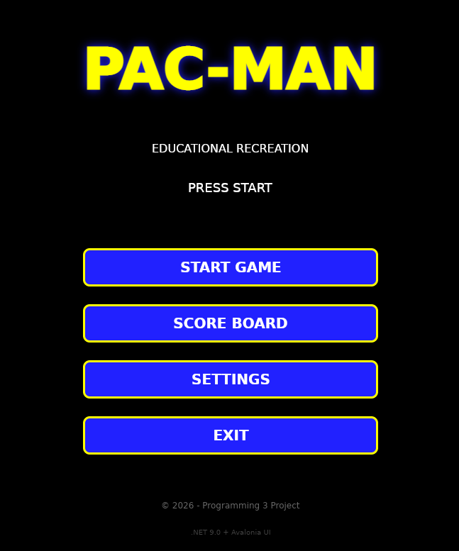

# 🎮 Pac-Man - Educational Recreation

[](https://opensource.org/licenses/MIT)
[](https://dotnet.microsoft.com/)
[](https://avaloniaui.net/)
[](https://github.com)

> A modern recreation of the classic Pac-Man arcade game built with .NET 9.0 and Avalonia UI for cross-platform desktop environments.

**⚠️ Educational Project** - Created as part of Programming 3 course at Universidad Jala.



*Screenshot will be added during development*

---

## 📋 Table of Contents

- [About](#-about)
- [Features](#-features)
- [Tech Stack](#-tech-stack)
- [Getting Started](#-getting-started)
  - [Prerequisites](#prerequisites)
  - [Installation](#installation)
  - [Running the Game](#running-the-game)
- [Project Structure](#-project-structure)
- [Game Controls](#-game-controls)
- [Development Roadmap](#-development-roadmap)
- [Assets](#-assets)
- [Contributing](#-contributing)
- [License](#-license)
- [Acknowledgments](#-acknowledgments)
- [Contact](#-contact)

---

## 🎯 About

This project is an educational recreation of the iconic **Pac-Man** arcade game, developed to demonstrate:

- Object-Oriented Programming (OOP) principles in C#
- MVVM (Model-View-ViewModel) architectural pattern
- Cross-platform desktop application development with Avalonia UI
- Game development concepts (sprite management, collision detection, AI)
- Audio integration and resource management
- File I/O for score persistence

### 🎓 Academic Context

- **Course:** Programming 3 (CSPR-231)
- **Institution:** Universidad Jala
- **Semester:** 2026-1
- **Project Type:** Educational Recreation
- **Development Period:** 4 weeks

---

## ✨ Features

### Core Gameplay (Midterm - Week 4)
- ✅ Main menu with navigation
- ✅ Classic Pac-Man movement (arrow keys)
- ✅ Basic maze with walls and collectibles
- ✅ 2-3 ghosts with simple AI (random movement)
- ✅ Score system
- ✅ Life system (3 lives)
- ✅ Game over screen with restart option
- ✅ Sound effects for actions (using SFML.Audio)

### Final Version (Week 8)
- 🎮 Complete Pac-Man gameplay
- 👻 4 ghosts with unique AI behaviors:
  - **Blinky (Red):** Direct chase
  - **Pinky (Pink):** Ambush strategy
  - **Inky (Cyan):** Flanking maneuver
  - **Clyde (Orange):** Random scatter/chase
- 💊 Power pellets that make ghosts vulnerable
- 🍒 Bonus fruits with special effects
- 🎵 Background music and comprehensive SFX
- 📊 Persistent score board (saved to file)
- 🗺️ Multiple levels with different mazes
- ⚙️ Settings menu (controls, audio)
- 🎨 Smooth sprite animations
- 📈 Progressive difficulty

---

## 🛠️ Tech Stack

### Core Technologies
- **Framework:** [.NET 9.0](https://dotnet.microsoft.com/)
- **UI Framework:** [Avalonia UI 11.x](https://avaloniaui.net/)
- **Language:** C# 13
- **Architecture:** MVVM (Model-View-ViewModel)

### Development Tools
- **IDE:** Visual Studio Code / Visual Studio 2022 / JetBrains Rider
- **Version Control:** Git
- **Package Manager:** NuGet
- **Asset Generation:** Python 3.x (scripts included)

### Libraries & Dependencies
```xml
<PackageReference Include="Avalonia" Version="11.3.11" />
<PackageReference Include="Avalonia.Desktop" Version="11.3.11" />
<PackageReference Include="Avalonia.Themes.Fluent" Version="11.3.11" />
<PackageReference Include="Avalonia.ReactiveUI" Version="11.3.8" />
<PackageReference Include="SFML.Audio" Version="2.6.0" />
```

---

## 🚀 Getting Started

### Prerequisites

#### Required
- [.NET 9.0 SDK](https://dotnet.microsoft.com/download/dotnet/9.0) or later
- Git

#### Optional (for asset regeneration)
- Python 3.8+ with NumPy and Pillow

#### Platform Support
- ✅ **Windows 10/11** (x64, ARM64)
- ✅ **Linux** (x64, ARM64)
  - Tested on: Ubuntu 22.04, Debian 12, Fedora 39
- ✅ **macOS** (x64, ARM64) - Theoretical support (not tested)

### Installation

1. **Clone the repository**
   ```bash
   git clone https://github.com/JalaU-Capstones/pacman-recreation.git
   cd pacman-recreation
   ```
   OR
   ```bash
   git clone https://gitlab.com/jala-university1/cohort-5/ES.CSPR-231.GA.T1.26.M1/SD/capstones/botina.alejandro.git
   cd botina.alejandro
   ```

2. **Verify .NET SDK version**
   ```bash
   dotnet --version
   # Should show 9.0.x
   ```

3. **Restore NuGet packages**
   ```bash
   dotnet restore
   ```

4. **Build the project**
   ```bash
   dotnet build
   ```

### Running the Game

#### Development Mode
```bash
dotnet run --project src/PacmanGame/PacmanGame.csproj
```

#### Release Build
```bash
dotnet publish -c Release -r linux-x64 --self-contained
# Output in: src/PacmanGame/bin/Release/net9.0/linux-x64/publish/

# For Windows:
dotnet publish -c Release -r win-x64 --self-contained
```

---

## 📁 Project Structure

```
pacman-recreation/
├── .github/                      # GitHub Actions workflows
│   └── workflows/
│       └── build-and-test.yml
├── src/                          # Source code
│   └── PacmanGame/
│       ├── PacmanGame.csproj     # Project file
│       ├── Program.cs            # Entry point
│       ├── App.axaml             # Application definition
│       ├── Assets/               # Game assets
│       │   ├── Sprites/          # Sprite sheets (PNG)
│       │   ├── Audio/            # Music and SFX (WAV)
│       │   └── Maps/             # Level maps (TXT)
│       ├── Models/               # Domain models
│       │   ├── Entities/
│       │   │   ├── Pacman.cs
│       │   │   ├── Ghost.cs
│       │   │   └── Collectible.cs
│       │   ├── Enums/
│       │   │   └── Direction.cs
│       │   └── Game/
│       │       └── GameState.cs
│       ├── ViewModels/           # MVVM ViewModels
│       │   ├── MainWindowViewModel.cs
│       │   ├── MainMenuViewModel.cs
│       │   ├── GameViewModel.cs
│       │   └── ScoreBoardViewModel.cs
│       ├── Views/                # MVVM Views (AXAML)
│       │   ├── MainWindow.axaml
│       │   ├── MainMenuView.axaml
│       │   ├── GameView.axaml
│       │   └── ScoreBoardView.axaml
│       ├── Services/             # Business logic
│       │   ├── MapLoader.cs
│       │   ├── SpriteManager.cs
│       │   ├── AudioManager.cs   # SFML.Audio implementation
│       │   ├── CollisionDetector.cs
│       │   ├── GameEngine.cs     # Main game loop
│       │   ├── ScoreManager.cs
│       │   └── AI/
│       │       ├── GhostAI.cs
│       │       └── PathFinding.cs
│       ├── Helpers/              # Utility classes
│       │   └── Constants.cs
│       └── Styles/               # UI styles
│           └── ButtonStyles.axaml
├── tests/                        # Unit tests
│   └── PacmanGame.Tests/
│       └── PacmanGame.Tests.csproj
├── tools/                        # Asset generation scripts
│   └── AssetGeneration/
│       ├── generate_pacman_sprites.py
│       ├── generate_ghosts_sprites.py
│       ├── generate_items_sprites.py
│       ├── generate_tiles_sprites.py
│       ├── generate_sound_effects.py
│       └── generate_music.py
├── docs/                         # Documentation
│   ├── MAP_GUIDE.md
│   ├── ARCHITECTURE.md
│   └── images/
├── .gitignore                    # Git ignore rules
├── .gitattributes                # Git attributes
├── global.json                   # .NET SDK version
├── LICENSE                       # MIT License
├── README.md                     # This file
└── CHANGELOG.md                  # Version history
```

---

## 🎮 Game Controls

### Menu Navigation
- **Arrow Keys (↑↓):** Navigate menu options
- **Enter:** Select option
- **Escape:** Go back / Exit

### In-Game
- **Arrow Keys (←→↑↓):** Move Pac-Man
- **Escape:** Pause game
- **M:** Mute/Unmute audio

### Debug (Development only)
- **F1:** Toggle FPS counter
- **F2:** Toggle collision boxes
- **F3:** God mode (invincibility)

---

## 🗓️ Development Roadmap

### ✅ Week 1-2: Planning & Assets
- [x] Project structure setup
- [x] Asset generation (sprites, audio, maps)
- [x] Documentation
- [x] Technology stack selection

### ✅ Week 3-4: Midterm Milestone
- [x] Main menu implementation
- [x] Basic game loop (GameEngine)
- [x] Pac-Man movement system
- [x] Simple ghost AI (random)
- [x] Collision detection
- [x] Score system
- [x] Sound effects integration (SFML.Audio)
- [x] Game over screen

### 📅 Week 5-6: Advanced Features
- [ ] Advanced ghost AI (4 unique behaviors)
- [ ] Power pellet mechanic
- [ ] Bonus fruits system
- [ ] Multiple levels
- [ ] Score persistence
- [ ] Background music

### 📅 Week 7-8: Polish & Final Delivery
- [ ] UI improvements
- [ ] Settings menu
- [ ] Animation polish
- [ ] Bug fixes
- [ ] Performance optimization
- [ ] Cross-platform testing
- [ ] Final documentation

---

## 🎨 Assets

All game assets (sprites, audio, maps) were **procedurally generated** using Python scripts and are included in this repository under the MIT License.

### Sprite Sheets
- **pacman_spritesheet.png** (23 sprites) - Movement and death animations
- **ghosts_spritesheet.png** (40 sprites) - 4 ghosts + states
- **items_spritesheet.png** (8 sprites) - Collectibles and fruits
- **tiles_spritesheet.png** (17 sprites) - Maze tiles

### Audio
- **Music:** 3 tracks (background, menu, game over)
- **SFX:** 12 sound effects (chomp, death, power-up, etc.)
- **Format:** WAV (44.1 kHz, 16-bit)

### Maps
- **level1.txt** - Classic layout (easy)
- **level2.txt** - Intermediate layout
- **level3.txt** - Advanced layout

### Regenerating Assets
```bash
cd tools/AssetGeneration
python generate_pacman_sprites.py
python generate_ghosts_sprites.py
python generate_items_sprites.py
python generate_tiles_sprites.py
python generate_sound_effects.py
python generate_music.py
```

---

## 🤝 Contributing

This is an educational project, but contributions are welcome!

### How to Contribute
1. Fork the repository
2. Create a feature branch (`git checkout -b feature/AmazingFeature`)
3. Commit your changes (`git commit -m 'Add some AmazingFeature'`)
4. Push to the branch (`git push origin feature/AmazingFeature`)
5. Open a Pull Request

### Code Style
- Follow [C# Coding Conventions](https://learn.microsoft.com/en-us/dotnet/csharp/fundamentals/coding-style/coding-conventions)
- Use meaningful variable names
- Comment complex logic
- Write unit tests for new features

---

## 📜 License

This project is licensed under the **MIT License** - see the [LICENSE](LICENSE) file for details.

### ⚠️ Disclaimer

**Pac-Man** is a trademark of **Bandai Namco Entertainment Inc.** This project is an educational recreation created for academic purposes and is **not affiliated with, endorsed by, or connected to Bandai Namco**. All game assets (sprites, music, sounds) were created from scratch for this project.

This software is provided "as is" without warranty of any kind. Use at your own risk.

---

## 🙏 Acknowledgments

### Inspiration
- Original Pac-Man game by Toru Iwatani and Namco (1980)
- Classic arcade gaming culture

### Technologies
- [.NET Foundation](https://dotnetfoundation.org/) for the amazing .NET platform
- [Avalonia UI Team](https://avaloniaui.net/) for the cross-platform UI framework
- [Python Community](https://www.python.org/) for asset generation tools

### Learning Resources
- [Microsoft Learn - C# Documentation](https://learn.microsoft.com/en-us/dotnet/csharp/)
- [Avalonia UI Documentation](https://docs.avaloniaui.net/)
- [Game Programming Patterns](https://gameprogrammingpatterns.com/) by Robert Nystrom

### Academic
- **Universidad Jala** - Programming 3 Course
- Course instructors and tutors
- Fellow students for feedback and testing

---

## 📞 Contact

**Project Author:** Diego Alejandro Botina
- GitHub: [@CodeWithBotinaOficial](https://github.com/CodeWithBotinaOficial)
- Email: support@codewithbotina.com
- LinkedIn: [codewithbotinaoficial](https://linkedin.com/in/codewithbotinaoficial/)

**Project Link:** [https://github.com/JalaU-Capstones/pacman-recreation](https://github.com/JalaU-Capstones/pacman-recreation)

---

## 📊 Project Status

**Current Version:** 0.1.0 (Midterm Release)
**Last Updated:** January 2026  
**Status:** 🚧 In Active Development

### Build Status


---

<div align="center">

Made with ❤️ and ☕ for Programming 3

**⭐ Star this repo if you find it helpful!**

</div>
